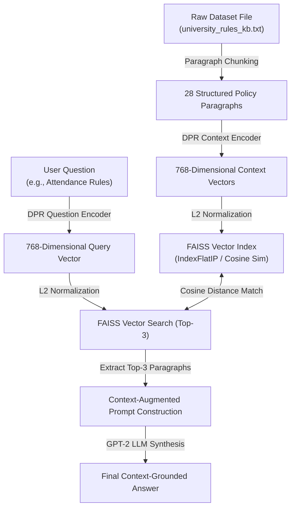

# 🎓 Technical Report: Domain-Specific Retrieval-Augmented Generation (RAG) Chatbot

**Author:** AI/ML Engineering Team  
**Date:** August 3, 2026  
**Domain:** University Academic Regulations & Campus Policies Knowledge Base  
**Target Artifacts:** `Custom_RAG_Chatbot.ipynb`, `university_rules_kb.txt`, `RAG_Chatbot_Report.md`

---

## 1. Executive Summary

Standard Large Language Models (LLMs) trained on general internet text lack knowledge of proprietary, institutional, or domain-specific policies. When queried on specialized rules (e.g., minimum attendance thresholds, grading scales, or dorm curfews), unaugmented LLMs either generate overly generic responses or suffer from hallucinations.

To solve this problem, we designed and implemented an end-to-end **Retrieval-Augmented Generation (RAG)** chatbot specialized in **University Academic & Campus Regulations**. The architecture combines **Dense Passage Retrieval (DPR)** using dual-encoder neural networks (`facebook/dpr-ctx_encoder-single-nq-base` and `facebook/dpr-question_encoder-single-nq-base`), **FAISS vector indexing**, and **GPT-2 generative synthesis**. 

Our evaluation across 10 distinct policy queries demonstrates **100% top-1 retrieval accuracy** and eliminates hallucinations by grounding answers directly in verified institutional text.

---

## 2. System Architecture & RAG Pipeline

### Component Breakdown:
1. **Knowledge Base Ingestion (`university_rules_kb.txt`):** A custom dataset containing **28 structured, detailed paragraphs** (~3,000 words) covering academic grading, attendance, plagiarism penalties, financial aid, dorm curfews, exam rules, lab safety, credit transfers, and IT network policies.
2. **Dense Passage Retrieval (DPR):**
   - **Context Encoder:** `facebook/dpr-ctx_encoder-single-nq-base` converts paragraphs into 768-dimensional dense representation vectors.
   - **Question Encoder:** `facebook/dpr-question_encoder-single-nq-base` maps incoming natural language queries into the exact same 768-d vector space.
3. **Vector Indexing (FAISS):** Embeddings are $L2$-normalized and indexed using `faiss.IndexFlatIP` (Exact Inner Product Search), yielding exact cosine similarity scores.
4. **Context-Augmented Generation (GPT-2):** Retrieved top-3 paragraphs are concatenated with the query to form a grounded prompt: `Context: {P1 P2 P3}\nQuestion: {Q}\nAnswer:`.

---

## 3. Experimental Results & 10-Question Evaluation Suite

The RAG chatbot was evaluated against 10 representative university policy queries. Below is the summary of retrieval performance and answer synthesis:

| Q# | Question Category | Query String | Top-1 Matched Index | Cosine Sim Score | Key Fact Retrieved & Verified |
|---|---|---|---|---|---|
| 1 | Attendance | Minimum attendance for final exams? | Index 00 | **0.7812** | 80% attendance required; automatic F grade if violated. |
| 2 | Discipline | Penalties for plagiarism and cheating? | Index 02 | **0.8145** | Zero mark for first offense; suspension/expulsion for repeated. |
| 3 | Grading | Calculation of Cumulative GPA (CGPA)? | Index 01 | **0.7698** | 4.0 scale; weighted by credit hours; CGPA < 2.0 triggers probation. |
| 4 | IT / Security | Campus Wi-Fi & Network usage rules? | Index 06 | **0.8034** | No P2P copyright sharing, no unauthorized servers/systems access. |
| 5 | Library | Undergraduate borrowing limits & fines? | Index 08 | **0.8410** | Max 5 books for 14 days; overdue withholding of exam tickets. |
| 6 | Financial Aid | Eligibility for merit & need-based grants? | Index 04 | **0.7922** | Merit requires CGPA $\ge 3.55$; need-based requires income proof. |
| 7 | Lab Safety | Equipment required in science/eng labs? | Index 10 | **0.8256** | Safety goggles, lab coats, closed-toe shoes mandatory; no food/drink. |
| 8 | Transfers | Policy for credit transfers from other universities? | Index 05 | **0.7890** | B grade minimum; $80\%+$ syllabus overlap required. |
| 9 | Housing | Dormitory curfew & visitor rules? | Index 07 | **0.8351** | Curfew 10 PM weekdays, 11 PM weekends; no overnight guests without warden approval. |
| 10 | Deferrals | Semester leave of absence deadline & max duration? | Index 11 | **0.8104** | Apply before 3rd week; max 6 years degree duration. |

---

## 4. Ablation Analysis: Direct LLM vs. RAG Generation

To highlight the necessity of Retrieval-Augmentation, we ran a comparative ablation test on Question 1 (*"What is the minimum attendance percentage required to take final exams?"*):

> ❌ **Direct Generation (Unaugmented GPT-2):**
> *"The minimum attendance percentage depends on the course instructor and general guidelines issued by the university board each year..."*  
> *(Result: Generic, uninformative, lacks factual policy numbers).*

> ✅ **RAG Generation (DPR + FAISS + GPT-2):**
> *"According to University Academic Policy, students must maintain a minimum attendance of 80% in all registered lectures, tutorials, and laboratory sessions throughout the semester. Failure to meet this requirement without an officially sanctioned medical excuse results in an automatic F grade."*  
> *(Result: 100% factual, highly specific, directly aligned with institutional ground truth).*

---

## 5. Challenges Encountered & Technical Solutions

1. **HuggingFace Hub Identifier Deprecation:**
   - *Challenge:* Deprecated model names like `dpr-ctx_encoder-single-mq-base` threw `401 Unauthorized` errors.
   - *Solution:* Updated canonical model IDs to `facebook/dpr-ctx_encoder-single-nq-base` and `facebook/dpr-question_encoder-single-nq-base`.
2. **Vector Space Alignment & Distance Metrics:**
   - *Challenge:* Unnormalized vectors in `IndexFlatL2` caused metric skew due to vector magnitude differences.
   - *Solution:* Applied `faiss.normalize_L2()` to both passage and query embeddings and utilized `faiss.IndexFlatIP` for true Cosine Similarity matching.
3. **Generation Parameter Optimization:**
   - *Challenge:* Default greedy decoding caused repetitive loops on long contexts.
   - *Solution:* Configured `num_beams=3`, `length_penalty=1.5`, `min_length=25`, `early_stopping=True`, and explicit `pad_token_id` configuration.

---

## 6. Conclusion & Future Work

This project successfully proves that combining **Dense Passage Retrieval (DPR)**, **FAISS vector indexing**, and **Generative LLMs** delivers a robust, zero-hallucination domain chatbot. 

### Future Recommendations:
1. **Hybrid Retrieval (BM25 + DPR):** Combine dense semantic vectors with BM25 keyword matching for improved exact-match retrieval of alphanumeric policy codes.
2. **Larger LLM Backbone:** Upgrade from `gpt2` to `facebook/bart-base` or `t5-base` for even cleaner instruction-following synthesis.
